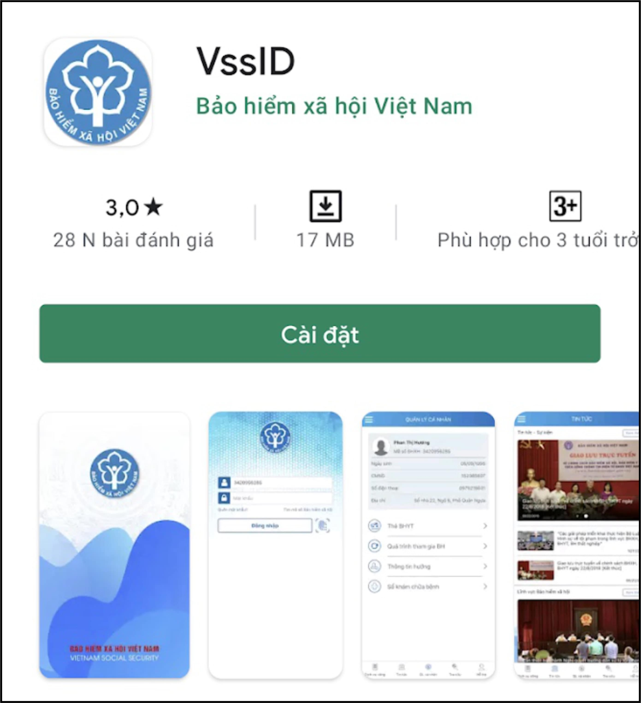
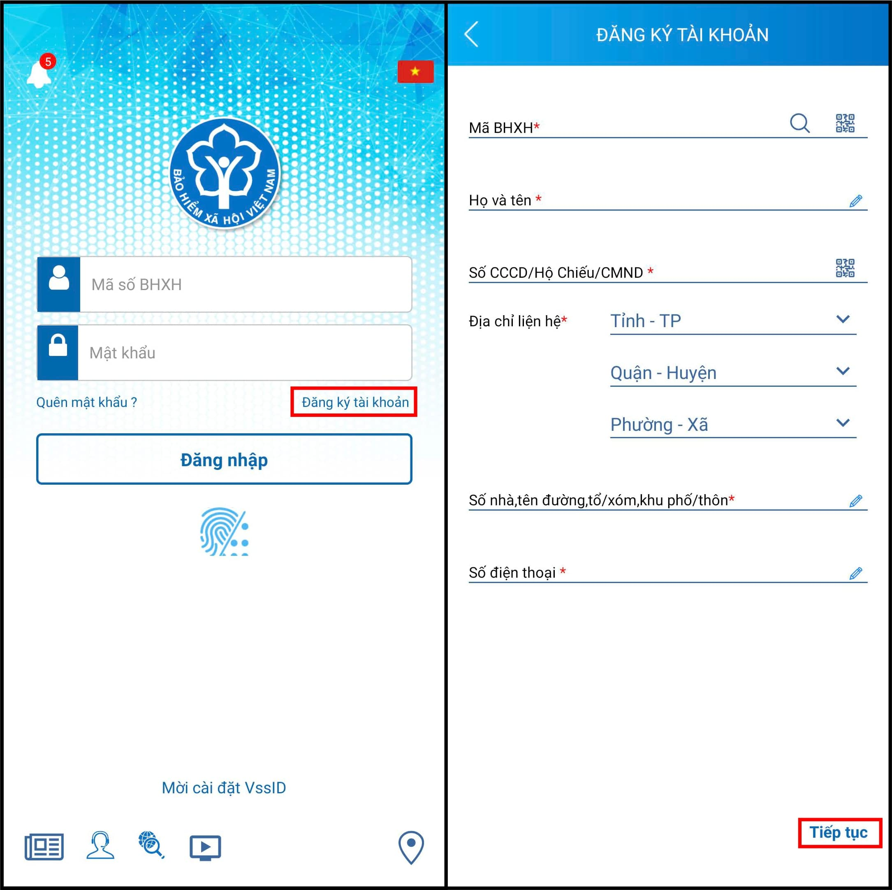
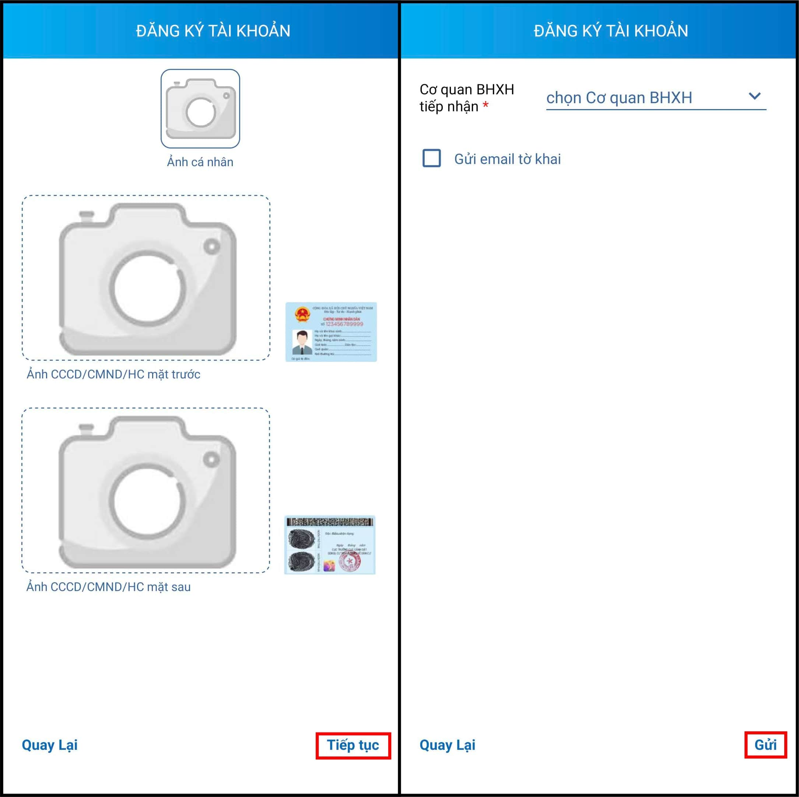
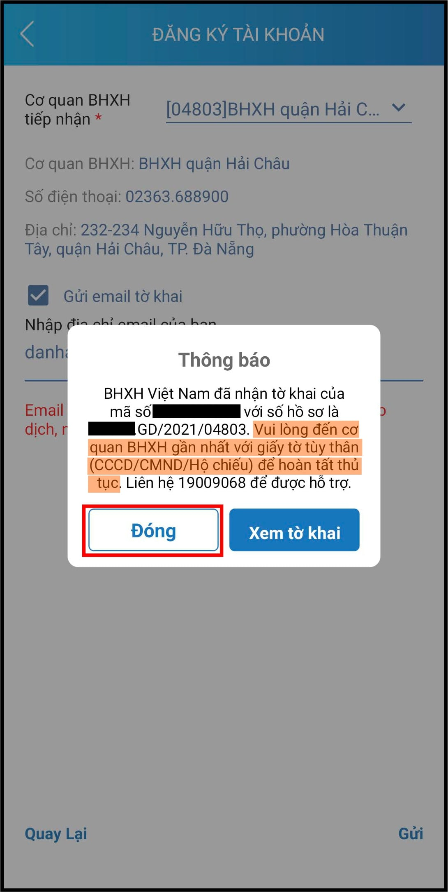

# Từ 1/6 sử dụng thẻ BHYT điện tử thay thế thẻ giấy trên cả nước
Từ ngày 1/6, người dân trên cả nước khi đi khám chữa bệnh Bảo hiểm y tế (BHYT) có thể sử dụng hình ảnh thẻ này trên ứng dụng VssID - Bảo hiểm xã hội số thay cho xuất trình thẻ BHYT bằng giấy thông thường

# Cách cài đặt VssID trên hệ điều hành Android và IOS
Để cài đặt VssID trên hệ điều hành Android người sử dụng thực hiện cài đặt theo 3 bước sau:

Bước 1: Vào kho ứng dụng Google Play/CH Play, gõ “VssID” trong ô tìm kiếm. 

Bước 2: Chọn ứng dụng VssID, như hình sau:

  

Bước 3: Chọn “Cài đặt/Install” để thực hiện cài đặt ứng dụng.

## Để cài đặt VssID trên hệ điều hành IOS người sử dụng thực hiện cài đặt theo 3 bước sau:

Bước 1: Vào kho ứng dụng AppStore, gõ vào ô tìm kiếm từ khóa “VssID” và chọn Tìm kiếm.

Bước 2: Chọn ứng dụng VssID như hình sau:

  

Bước 3: chọn “Nhận” để thực hiện cài đặt ứng dụng.

Sau khi thực hiện xong 3 bước cài đặt, ứng dụng sẽ được tự động cập nhật trên thiết bị di động. Người sử dụng nhấn vào ứng dụng để đăng nhập và sử dụng.
# Cách đăng ký sử dụng
Khi đăng ký cần chuẩn bị trước hình ảnh cá nhân, CCCD/CMND

Bước 1: Mở ứng dụng VssID chọn "Đăng ký tài khoản" và điền đầy dủ thông tin, sau đó chọn tiếp tục.

Lưu ý: Mã BHXH là 10 số cuối của BHYT.

  

Bước 2: chụp hình hoặc chọn ảnh cá nhân và CCCD/CMND, sau đó chọn tiếp tục. Và chọn cơ quan BHXH trùng với nơi cấp của BHYT. Sau đó nhấn gửi

  

Sau khi hoàn tất việc đăng ký bạn sẽ nhận được thông báo của BHXH.
Sau khi nhận được thông báo, bạn đến cơ quan BHXH gần nhất với giấy tờ tùy thân để hoàn tất thủ tục.

  

Sau khi đến cơ quan BHXH để hoàn tất thủ tục bạn sẽ được cấp tài khoản và mật khẩu đăng nhập VssID để đăng nhập và sử dụng.

Lưu ý: Bạn nên đổi mật khẩu ngay để đảm bảo an toàn.

-TiPiCi Shanks-

[Tham khảo thêm cách sử dụng ứng dụng VssID tại đây](https://ebh.vn/tin-tuc/huong-dan-su-dung-ung-dung-vssid)

